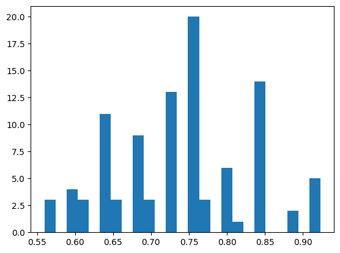
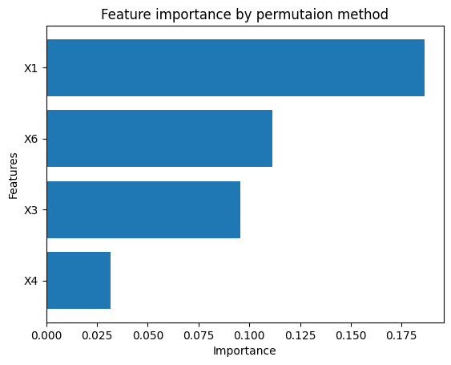
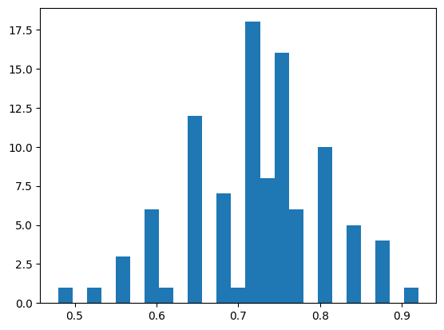
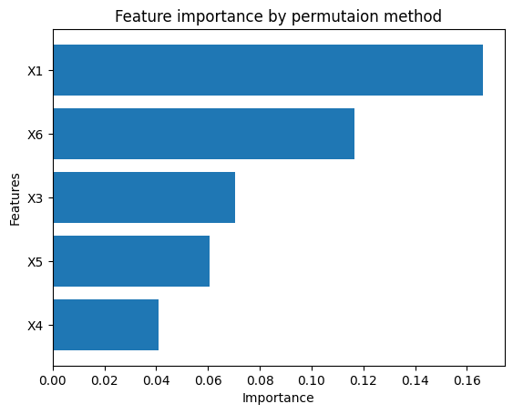
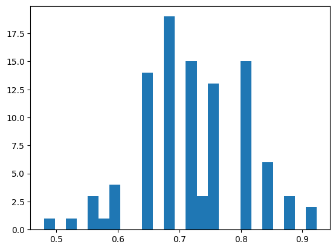
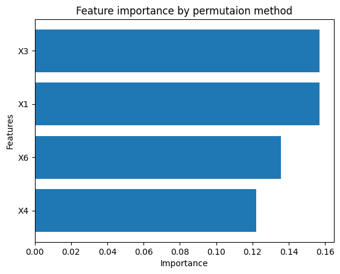
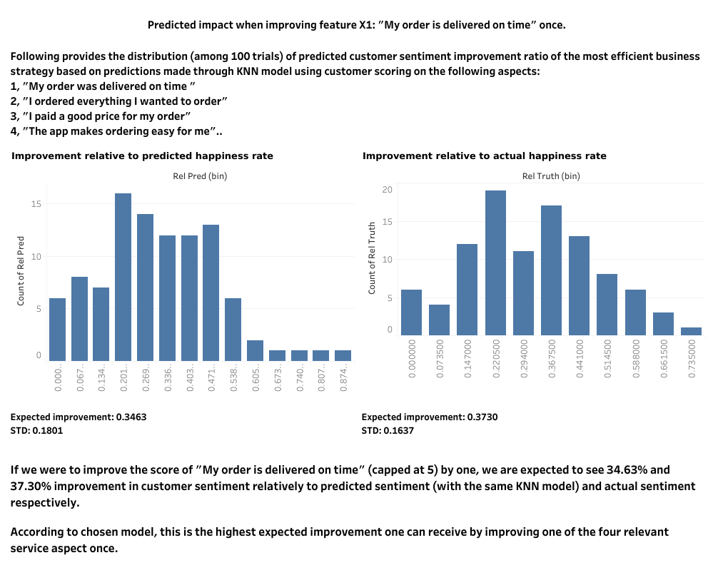

# Customer Sentiment Prediction 

## Raw Data 

* Y := target attribute (Y) with values indicating 0 (unhappy) and 1 (happy) customers
* X1 := my order was delivered on time
* X2 := contents of my order was as I expected
* X3 := I ordered everything I wanted to order
* X4 := I paid a good price for my order
* X5 := I am satisfied with my courier
* X6 := the app makes ordering easy for me

Attributes X1 to X6 indicate the responses for each question and have values from 1 to 5 where the smaller number indicates less and the higher number indicates more towards the answer. 

Data summary: There are total 126 data points, 69 of which have Y=1 (happy customer). 69/126 is roughly 0.5476, indicating that this data set, as a whole, is quite balanced. 

## Goal and KPI 

Predict if a customer is happy or not based on the answers they give to questions asked. 

KPI: The official KPI is the Accuracy Score. The indicated goal is "Reach 73% accuracy score or above". 

## Baseline (trivial) Model 

We will use the "assume everyone is happy" (trivial) model as the baseline model. Which, by construction, has an accuracy score of 0.5476. 

## Result Summary

* Preferred model: KNN with 5 neighbors using raw features X1, X3, X4, and X6; force Data Selector to only use X1, X6, and F score weighted mean. This model produced average accuracy of 73.76%, improving upon the trivial baseline model by 34.70%. 

* Raw feature selection insight: It appears that the models actively perform better by removing raw feature X2 ("contents of my order was as I expected"). The 2/3 of the best performing models only utilized raw features X1, X3, X4, and X6, so I suggest only those features are the most important for our set goal of customer sentiment prediction in current context, in particular, utilizing X2 appears to be counter-productive in general. 

## Tech Stack 

### Python Packages  

* numpy, pandas (for data engineering and calculation) 
* sklearn (for model and pipeline construction) 
* scipy (for evaluation and hypothesis testing) 
* joblib (for parallel computing) 
* gdown (for data retrieval) 
* matplotlib (for visualization) 
* streamlit (for interactive dashboard) 

### Otherwise 

* Tableau (for dashboard)

## Challenges 

* The low amount of data prevents of from using more complicated models that are better at understanding while take longer to learn. Thus, we will focus on "simpler" models. 
* The low amount of data also makes it so that any "one split" train and test split can be "unlucky" or "lucky", making it unreliable to evaluate our model. This causes our decision on CV strategy (see nect section). 

## CV (Cross-Validation) Strategy and Metrics

### CV and Metric Summary 

We will take advantage the pre-built repeated stratified kfold method of sklean package. We will universally use 5 splits and 20 repeats, that is 100 trials in total for each model (with certain hyper-parameters) (so that the CV concludes before I concluded being alive). 

This brings us to the metric(s) we will use to judge our model, we will describe them in both technical and intuitive context (The intuitive description might not be fully rigorous): 

| Name | Technical | Intuition | 
|----------|-----------------------|------------------|
| acc_mean $\in [0,1]$ | The mean of accuracy score of the 100 trials | The average accuracy of this model |
| f1_mean $\in [0,1]$ | The mean of f1 score of the 100 trials | The average f1 score of this model| 
| above_73 $\in [0,1]$ | The number of trials among the 100 that has accuracy score above 73% | The confidence level that the model has accuracy at least 73% | 
| norm_above_73 $\in [0,1]$ | Assuming that the distribution of accuracy score is a normal distribution with the same mean and std as the 100 trials, the confidence level that the model has accuracy at least 73% | The confidence level that the model has accuracy at least 73% under the assumption that the accuracy score is normally distributed | 
| acc_mean_above_73 $\in [0,1]$ | p-value of the hypothesis test below | p-value of the hypothesis test below | 

**Remark**: 
The "acc_mean_above_73" will be the p-value of the Z-test (under the assumption that the sample std is the real std) for: 

Let $\mu_m:=\text{The mean of the distribution of the accuracy score of the model }m$
* $H_0$: $\mu_m\geq 0.73$
* $H_A$: $\mu_m<0.73$ 

This will also be similar to the p-value of the t-test for the same hypothesis (the degree of freedom is $99=100-1$, so the t-distribution, which is also symmetric about its mean, is extremely similar to the normal distribution). 

Due to this reason, "acc_mean_above_73" is my "favorite" metric, as it packs the most "statistical meaning". 

### Applying CV and Visualizing the Performance

* Due to amount of calculation needed, the CV is done under parallel computing with CPU with joblib Parallel and delayed. 

* I would like to record all the performances and associated hyper-parameters, so I built a custom-made function evalutate_combo (with similar function to GridSearchCV) to be applied within the CV loops, the source code of this is in "./proj_mod/training.py". 

* To visualize the performance of a selected model (with certain hyper-parameters), I built a custom-made function show_result, which plot the histogram of the distribution of the accuracy scores of the 100 trials, and the importance of each raw features (with permutation_importance) for the model of topic. The source code is also in "./proj_mod/training.py". 

## Model Pipelines 

### Summary 
I have applied *Log Regression (LogReg)*, *(Gaussian, Multinomial, Complement, and Categorical)-Naive Bayesian (NB)*, *Decision Tree (DT)*, *Support Vector Classifier (SVC)*, and *K Nearest Neighborhood (KNN)* models (as **the main step** of a pipeline). Among which, KNN, SVC, and DT provided favorable results, which I will detail later. 

### A standard model pipeline 

I will be using the Built-in Pipeline function of sklearn. 
There are two custom layers that perform data transforming (see source code in "./proj_mod/training.py"): 

* Data Creator: Manufactures new features with the raw features provided. 
* Data Selector: Selects features either automatically by applying pre-set conditions, or simply select with a pre-set list: When done automatically, the layer ranks the features by F test (by sklearn f_classif), and select according to pre-set conditions on F scores and p values. 

After above data transformation, we load it to the main model layers. 

### (Selected) Model Performances 

In the following, I detail some selected models with interesting performances: 

---
#### KNN 

**Remark**: This is, currently, the best model. 

* Pipeline: 

Data Creator --> Data Selector --> StandardScaler --> KNN 

* Raw features used: X1, X3, X4, X6 
* Hyper-parameter table: 

| Used (Manufactured) Features | KNN Number of Neighbors | 
|------------------------------|-------------------------| 
| X1, X6, F_w_mean             | 5                       |

Where "F_w_mean", stands for "F score weighted mean", created with following method by the Data Creator layer: 
Let $\vec{x}$ be the vector of raw features, for instance, $` \vec{x}:=(X1,X3,X4,X6)^{\top} `$ in current context; let $l$ be the length of $\vec{x}$, which is $4$ in current context. Let $\vec{F}$ be the vector of F scores of the raw features obtained by applying F test on the raw features, for instance, $` \vec{F}:=(F_{1},F_{3},F_{4},F_{6}) `$ in current context. Then: 

```math
\text{F score weighted mean}:=\frac{\vec{F}\; \vec{x}}{l}
``` 

* Performance table: 

| acc_mean | f1_mean | above_73 | norm_above_73 | acc_mean_above_73 | 
|----------|---------|----------|---------------|-------------------| 
| 0.7376   | 0.7641  | 0.52     | 0.5342        | 0.8048            | 

* Accuracy score distribution histogram: 



* Raw feature importance ranks: 



---
#### SVC 

* Pipeline: 

Data Creator --> Data Selector --> StandardScaler --> SVC 

* Raw features used: X1 X3 X4 X5 X6 
* Hyper-parameter table: 

| Used (Manufactured) Features | Kernel of SVC | Margin of SVC |
|------------------------------|---------------|---------------|  
| X1, X6, mean                 | rbf           | 100           | 

Where "mean" is the mean of the raw features. 

* Performance table: 

| acc_mean | f1_mean | above_73 | norm_above_73 | acc_mean_above_73 | 
|----------|---------|----------|---------------|-------------------| 
| 0.7227   | 0.7663  | 0.50     | 0.4650        | 0.1896            | 

* Accuracy score distribution histogram: 



* Raw feature importance ranks: 



---
#### DT 

* Pipeline: 

Data Creator --> Data Selector --> DT 

* Raw features used: X1 X3 X4 X6 
* Hyper-parameter table: 

| Used (Manufactured) Features | Max Depth of DT |  
|------------------------------|-----------------|  
| X1, X6, mean                 | 6               |  

* Performance table: 

| acc_mean | f1_mean | above_73 | norm_above_73 | acc_mean_above_73 | 
|----------|---------|----------|---------------|-------------------| 
| 0.7198   | 0.7402  | 0.43     | 0.4521        | 0.1144            | 

* Accuracy score distribution histogram: 



* Raw feature importance ranks: 



## Business Prediction and Suggestion 

I offer both an interactive dashboard (recommended) and a static dashboard. 

### Interactive dashboard with automatic business suggestion according to "improvement budget" allotted 
Using The best KNN model (mentioned above), we provide business prediction and Suggestion through interactive dashboard generated by streamlit. 
To use the interactive dashboard, run file: [streamlit interactive dashboard](./dashboard/streamlit_KNN.ipynb). Or run code 
```
streamlit run streamlit_KNN.py
```
under [./dashboard/](./dashboard/). 

### "Immediate" best business suggestion 
The best "immediate" business suggestion according to the same best KNN model is presented in [public tableau](https://public.tableau.com/views/CustomerSentimentStrategy/Dashboard1?:language=en-US&:sid=&:redirect=auth&:display_count=n&:origin=viz_share_link): 



